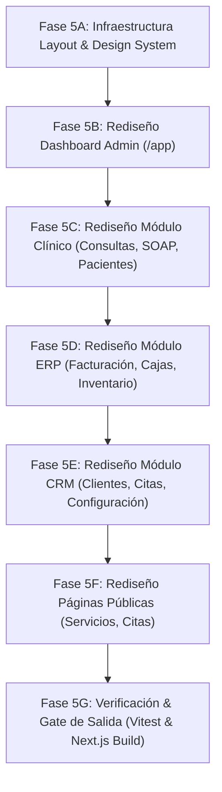

# Plan Maestro de Rediseño UX/UI Veterinario (Versión B)

> **Documento de Especificación y Arquitectura Visual**  
> **Rama de Trabajo:** `veterinaria-redesign`  
> **Fecha:** 16 de Septiembre de 2026  
> **Estado:** Fase 5 - Planificación y Design System (Previo a Implementación)

---

## 1. Contexto & Baseline de Entrada

El sistema **Control Inventario + CRM Veterinario** cuenta con una base funcional estable y validada en la rama `veterinaria` (commit base `1204d65` / `a929baa`).

### Baseline Técnico Verificado
- **Rama Actual:** `veterinaria-redesign` (creada a partir de `veterinaria`).
- **Pruebas Automatizadas (Vitest):** 8 suites ejecutadas exitosamente / 45 tests pasados / 0 fallos.
- **Compilación Next.js:** 95 de 95 páginas estáticas generadas sin advertencias ni errores de TypeScript.
- **Backend Laravel:** Operando en `http://127.0.0.1:8001` (SQLite, multi-tenancy, transacciones ACID intactas).
- **Regla Inflexible:** La funcionalidad real del backend y las APIs existentes guían la lógica; el diseño de referencia guía la interfaz.

---

## 2. Análisis Visual de las Referencias (`docs/referencias-redesign/`)

Las 4 imágenes de referencia ubicadas en `docs/referencias-redesign/` establecen el estándar estético y compositivo para la Versión B del sistema:

### 2.1. `01-dashboard-referencia.png` (Dashboard Principal & Layout Administrativo)
- **Fondo & Estructura:** Contenedor general en tono slate claro suave (`#F4F6F9`) con tarjetas en blanco puro (`#FFFFFF`) con bordes redondeados acentuados (`rounded-2xl` / `rounded-3xl`) y sombras sutiles.
- **Sidebar Izquierdo:** Fondo blanco contrastado, logotipo institucional con insignia de huella veterinaria, enlaces con iconos outline y estado activo en píldora azul suave (`bg-blue-50 text-blue-600 font-semibold`). En la parte inferior, widget ilustrado (*"Animales más sanos, vidas más felices"*).
- **TopBar de Control:** Buscador global con atajo de teclado (`⌘K` / `Ctrl+K`), selector de fecha ("Martes, 16 de septiembre de 2026"), filtro temporal (Hoy / Semana / Mes / Año) y perfil del veterinario con avatar.
- **Banner de Bienvenida (Hero Card):** Saludo personalizado ("¡Hola, Dr. Carlos!") en fondo azul cielo con ilustración de mascota y mensaje cálido ("Gracias por cuidar lo que más importa ♡").
- **Grid de KPIs:** 4 métricas principales con icono en contenedor de color pastel, contador grande e indicador de tendencia porcentual (`+12% vs. mes anterior`).
- **Gráficos & Métricas:** Curva suave de tendencia de consultas (Line chart con gradiente), gráfico circular de distribución por especie (Donut chart con leyenda lateral), barras pareadas de Ingresos vs. Gastos y barras de progreso horizontales para servicios más realizados.
- **Panel Lateral Derecho:** Próximas citas con timeline y avatares de mascotas, alertas de inventario (Stock bajo en rojo, Citas por confirmar en amarillo) y feed de actividad reciente.

### 2.2. `02-consulta-clinica-referencia.png` (Ficha Clínica & SOAP)
- **Encabezado de Atención:** Breadcrumb dinámico (`Consultas > Consulta #5`), badge de estado en atención (`En Atención (Abierta)`), metadatos clave y tarjeta decorativa a la derecha.
- **Ficha del Paciente:** Fotografía circular destacada, nombre ("Max"), badge de estado activo, resumen de especie, raza, edad, peso ("Golden Retriever · Macho · 3 años · 33.10 kg") y datos del propietario con acceso a llamada/WhatsApp.
- **Tarjetas de Signos Vitales:** Tarjetas limpias con icono circular para Peso (`33.10 kg`), Temperatura (`38.5 °C`) y Tarifa de Consulta (`$ 0`).
- **Sección Historia Clínica (SOAP):** Grid de 4 tarjetas cromáticas diferenciadas para cada fase:
  - **S (Subjetivo / Anamnesis):** Fondo azul suave (`bg-blue-50/50 border-blue-200`).
  - **O (Objetivo / Examen):** Fondo verde menta (`bg-emerald-50/50 border-emerald-200`).
  - **A (Análisis / Diagnóstico):** Fondo cálido/ámbar (`bg-amber-50/50 border-amber-200`).
  - **P (Plan Terapéutico):** Fondo púrpura (`bg-purple-50/50 border-purple-200`).
- **Tabla de Conceptos & Servicios:** Botón flotante naranja `+ Agregar Concepto Clínico`, tabla limpia con insumos, medicamentos y procedimientos, columna de estado de inventario/facturación y fila de total estimado.
- **Acciones Inferiores:** Botón outline `< Volver` a la izquierda y botón verde primario `✓ Finalizar y Facturar en ERP` a la derecha.

### 2.3. `03-modal-concepto-clinico-referencia.png` (Modal por Pestañas - Modo Oscuro)
- **Modal Flotante:** Estilo dark mode profesional (`bg-[#0B0F17]` / `bg-[#111827]`) con bordes redondeados (`rounded-2xl`) y sombra proyectada.
- **Navegación por Pestañas:** 5 pestañas superiores (`Concepto`, `Medicamentos`, `Insumos`, `Procedimientos`, `Servicios`) con estado activo destacado en borde e iluminación esmeralda (`#10B981`).
- **Columna Izquierda (Formulario):** Entradas limpias para título, descripción/notas, y tarjeta inferior de ayuda contextual (*"¿Cuándo usar este tipo?"*).
- **Columna Derecha (Vista Previa en Vivo):** Tarjeta principal de previsualización del ítem con desglose de cantidad, precio y subtotal, acompañada por dos tarjetas indicadoras del efecto en Facturación (CxC) y en Inventario (Bodega).
- **Footer:** Botón secundario `Cancelar` y botón primario verde brillante `+ Agregar a la Consulta`.

### 2.4. `04-servicios-referencia.png` (Servicios & Páginas Públicas)
- **Consistencia Visual:** Mantener la estética limpia, amigable y profesional en los catálogos públicos y páginas institucionales, usando tarjetas redondeadas, colores pasteles y badges claros para estado y precios.

---

## 3. Definición del Design System Veterinario (Tokens & Componentes)

Para asegurar la coherencia estética en **todas las páginas del sistema** durante el rediseño, se establece el siguiente Design System:

```text
┌─────────────────────────────────────────────────────────────────────────┐
│                      DESIGN SYSTEM VETERINARIO                          │
├─────────────────────────────────────────────────────────────────────────┤
│ Colores Principales:                                                    │
│  - Fondo Principal (Admin):   #F4F6F9 (Slate-100/50)                     │
│  - Tarjetas / Paneles:        #FFFFFF (White pure)                      │
│  - Primario / Marca:          #2563EB (Blue-600) / #1d4ed8 (Blue-700)   │
│  - Éxito / Acción Positiva:   #10B981 (Emerald-500) / #059669 (Green-600)│
│  - Advertencia / Alerta:      #F59E0B (Amber-500)                       │
│  - Error / Eliminar:          #EF4444 (Red-500)                         │
│  - Dark Mode (Modales):       #0B0F17 / #111827                        │
│                                                                         │
│ Tipografía & Bordes:                                                    │
│  - Fuente:                    Inter / system-ui                         │
│  - Radio de Bordes:           rounded-2xl (16px) / rounded-3xl (24px)   │
│  - Sombras:                   shadow-sm (tarjetas), shadow-xl (modales) │
│  - Bordes:                    border border-slate-100 / border-slate-800│
└─────────────────────────────────────────────────────────────────────────┘
```

---

## 4. Auditoría Estructurada de Páginas a Rediseñar

Excluyendo la página de inicio principal (`/`), se auditarán y rediseñarán las siguientes 60+ vistas del sistema:

### 4.1. Módulos Clínicos
1. `/app/consultas`: Lista de consultas clínicas con filtros de estado y badges.
2. `/app/consultas/[id]`: Ficha completa de consulta con SOAP y gestión de conceptos.
3. `/app/pacientes`: Catálogo visual de pacientes (perros, gatos, exóticos) con avatares.
4. `/app/pacientes/[id]`: Ficha completa del paciente (historia médica, vacunas, tutor).
5. `/app/citas`: Gestión de citas y estados en sala de espera.
6. `/app/agenda`: Vista de calendario de atención veterinaria.
7. `/app/vacunas` & `/app/vacunas-pendientes`: Control de esquemas de inmunización.
8. `/app/recetas` & `/app/diagnosticos`: Emisión de fórmulas médicas y diagnósticos.

### 4.2. Módulos ERP & Financieros
1. `/app` & `/app/dashboard`: Panel de control general con métricas e indicadores.
2. `/app/facturas` & `/app/facturas/[id]`: Listado y detalle de facturación interna.
3. `/app/cajas`, `/app/sesiones-caja`, `/app/movimientos-caja`: Control de flujo de efectivo.
4. `/app/cuentas-por-cobrar` & `/app/cuentas-por-pagar`: Gestión de morosidad y créditos.
5. `/app/productos`, `/app/bodegas`, `/app/alertas-stock`: Inventario de medicamentos e insumos.
6. `/app/ordenes-compra` & `/app/recepciones-compra`: Compras a proveedores.

### 4.3. Módulos CRM & Configuración
1. `/app/clientes` & `/app/clientes/[id]`: Gestión de tutores/propietarios de mascotas.
2. `/app/proveedores` & `/app/contactos`: Directorio comercial.
3. `/app/usuarios`, `/app/roles`, `/app/configuracion`: Administración de permisos y sede.
4. `/app/reportes`, `/app/reportes-clinicos`, `/app/reportes-comerciales`: Analítica.

### 4.4. Páginas Públicas Internas
1. `/servicios` & `/servicios/[slug]`: Catálogo público de servicios médicos y estéticos.
2. `/agendar-cita` & `/solicitar-cita`: Formulario público de reservas de cita.
3. `/catalogo` & `/catalogo/[id]`: Tienda/Catálogo de productos veterinarios.
4. `/contacto`, `/nosotros`, `/equipo`: Páginas institucionales.
5. `/portal` & `/portal/entrar`: Portal del cliente/tutor.

---

## 5. Plan de Ejecución por Fases (Fases 5A - 5G)



---

## 6. Criterios de Aceptación y Parada

1. **Cero Regresiones Funcionales:** Todas las llamadas a la API de Laravel y la persistencia en SQLite deben mantenerse 100% operativas.
2. **Cumplimiento de Pruebas:** Los 45 tests existentes en Vitest deben continuar pasando exitosamente.
3. **Compilación Limpia:** El build de Next.js debe generar las 95 páginas sin errores de TypeScript.
4. **Pausa Requerida:** La implementación del código comenzará únicamente tras la aprobación de este plan maestro por parte del usuario.
